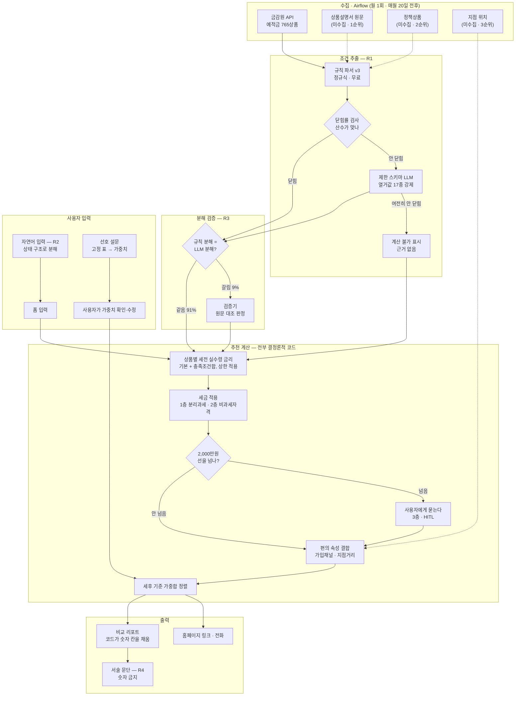

# 시스템 설계 — 부품·계약·측정

> 작성 2026-08-26 · 문제 정의는 [`problem.md`](./problem.md)
>
> **이 문서의 용도**: 다음 세션의 Agent가 설계를 이어받을 때 읽는 문서다.
> 사람이 작업 흐름을 따라가는 용도로는 [`problem.md`](./problem.md)와
> 시각 문서를 먼저 본다.
>
> **읽는 법**: 부품마다 `계약`(입출력) · `상태`(구현됐나) · `없으면`(빠지면 어떻게 되나) ·
> `측정`(무엇으로 값어치를 재나)이 붙어 있다. 넷 중 `없으면`과 `측정`이 핵심이다 —
> 이게 비어 있는 부품은 만들 근거가 아직 없다는 뜻이다.

## 1. 전체 흐름



**점선은 아직 데이터가 없는 경로다.**

## 2. 부품별 계약

### R1 — 조건 추출 (공시 문구 → 구조)

```
계약  입력: spcl_cnd 텍스트 + 가입기간(개월)
      출력: { cap: float|null, items: [{condition_type(17종), rate, polarity,
                                       applies_to_term, exclusive_group, evidence}] }
      금리(기본·최고)는 절대 입력에 넣지 않는다 — 채점 신호를 보면 값을 맞춰버린다
```

- **상태**: 구현 완료. `src/analysis/finlife_rules.py`(규칙 v3) ·
  `src/analysis/extract_llm.py`(제한 스키마 LLM)
- **없으면**: 실수령 금리를 계산할 수 없다. 시스템 전체가 성립하지 않는다
- **측정**: 닫힘률. 처음 보는 기관에서 규칙 62.6% · LLM 71.4% · **폴백 80.2%**
  (`../decisions/0007-rules-refined-then-closed.md`)

**폴백 구조가 핵심이다.** 규칙과 LLM이 서로 다른 것을 놓친다(규칙만 맞힌 16행,
LLM만 맞힌 32행). 그래서 순차로 태우면 둘 다 이기고 LLM 호출은 39%로 줄어든다.

> **주의**: 80.2%는 사후에 계산한 조합이다. 사전등록하고 잰 값이 아니다.
> 다음 실험의 1순위로 올려야 한다.

### R2 — 사용자 자연어 → 상태 구조

```
계약  입력: "급여이체 하고 카드도 쓰는데 1년에 월 50만원씩 넣을 적금"
      출력: { 급여_연금이체: true, 카드실적: true, term: 12, monthly: 500000 }
      출력 필드는 R1의 조건 유형 17종과 같은 축을 쓴다
```

- **상태**: 미구현
- **없으면**: 폼으로 받으면 된다. 시스템은 돈다. 편의성만 떨어진다
- **측정**: 필드별 추출 정확도. **틀리는 필드만 폼으로 확정 요청**하는 하이브리드가 목표

**개인정보 이유로 로컬 SLM을 1순위로 둔다.** 급여·소득·직장 위치가 입력이다.
API는 상한 기준선(ceiling)으로만 쓴다.

### R3 — 분해 검증 (닫힘률이 못 잡는 것)

```
계약  입력: (공시 원문, "첫거래 조건이 0.35%p를 준다")
      출력: SUPPORTED / UNSUPPORTED / INSUFFICIENT
```

- **상태**: 미구현. 선행 저장소 `finance_verifier/src/verifier/client.py`가 같은 계약
- **없으면**: 합계는 맞는데 조건별 배분이 틀린 경우를 못 잡는다.
  사용자별 계산이 조용히 틀린다
- **측정**: 규칙 분해와 LLM 분해가 갈리는 비율 — **실측 9%**

**왜 닫힘률로 대체할 수 없나** — 닫힘률은 합계만 본다. 실제 관측 예시:

```
다시만난예금(모바일전용) 12개월 · 실제 폭 0.35
  규칙   항목 [0.25, 0.35] + 상한 0.35  → 합계 0.35  ✓ 닫힘
  LLM    항목 [0.35] (첫거래_신규고객)   → 합계 0.35  ✓ 닫힘

둘 다 "닫혔"지만 구조가 다르다. 첫거래만 충족하는 사용자에게
LLM 분해는 0.35를 주고, 규칙 분해는 답을 낼 수 없다.
```

### R4 — 리포트 서술 문단

```
계약  입력: 코드가 이미 채운 리포트 (숫자 칸 전부 확정)
      출력: 서술 칸만. 숫자 사용 금지
```

- **상태**: 미구현
- **없으면**: 템플릿으로 쓴다. 정확도에 영향 없다
- **측정**: **없다. 편의 기능으로 분류한다** — 잴 수 없는 걸 성과로 주장하지 않는다

**안전은 구조로 보장한다.** LLM 출력 스키마에 숫자 칸을 아예 넣지 않으면
과장할 수가 없다. 서술 칸 숫자 금지는 `assert not re.search(r"\d", prose)` 한 줄.

### 계산기 — 실수령 금리

```
계약  입력: (사용자 상태, 상품의 추출된 구조)
      출력: 실수령 예상금리 + 충족/미충족 조건 목록

      순서: 1. applies_to_term 이 false 인 항목 제거
            2. exclusive_group 은 합이 아니라 그룹 최댓값
            3. 사용자 상태로 충족 여부 판정
            4. 충족분 합계에 cap 적용
            5. 기본금리 + 위 값            = 세전 실수령 금리
            6. min(위 값, 공시 최고금리)     ← 상한. 원값은 raw_hi 로 남긴다
            7. 세율 적용                    = 세후 실수령 금리  ← 정렬은 이 값으로
            8. 층 라벨 부여                 확정 / 범위 / 설명부족 / 추출불확실 / 계산불가
```

- **상태**: **구현 완료** — `src/analysis/calculate.py`
- **없으면**: 시스템이 없다
- **측정**: 결정론적이라 단위 테스트로 충분. 정확도는 R1·R3에 달렸다

**모르는 것을 추측하지 않는다.** 사용자가 답하지 않은 조건이 있으면 하나의 숫자가 아니라
**범위**를 낸다(최소 = 확실히 충족되는 것만, 최대 = 모르는 것을 다 충족으로 가정).

#### 공시 최고금리 상한 — 그리고 그게 무엇을 가리는지

```
저축은행 12개월 297개
  넘침(우리가 더 뽑음)   181   61%      ← 주된 실패
  모자람                  6    2%
  맞음                  110   37%

상한을 걸면 공시 초과 표시 0건. 가장 심한 예 11.50% → 8.00%
```

**상한은 증상만 막는다.** 넘치는 181건은 우리 추출 문제이고, 상한은 그걸 화면에서만
가린다. 그래서 `raw_hi`(상한 전 값)를 남겨 측정에 쓴다.

**닫힘률이 이걸 감췄다** — 절댓값만 봐서 넘쳤는지 모자랐는지 구분하지 않았다.
`0007`에서 은행권 마이너스 6건을 "파서 문제, 후순위"로 미뤘는데, 저축은행에서는
그게 주된 실패 유형이었다. **부호별 보고를 지표에 추가해야 한다.**

#### 층 라벨 — 제외하지 않는다

`확정` · `범위` 는 메인 화면, 나머지는 아래 섹션. 제외하면 63%를 버리고,
닫힘률이 100%로 고정되어 개선을 측정할 수 없다.

### 세금 계산 — 세후 금리

```
계약  입력: (세전 실수령 금리, 예치금액, 기간, 사용자 자격, 기존 금융소득[3층만])
      출력: 세후 실수령 금리 + 적용 세율 + 3층 해당 여부
```

- **상태**: 미구현
- **없으면**: 세전 금리로 줄을 세운다. **순위가 틀린다** — 비과세 상품은 세전이 낮아도
  세후로 이긴다
- **측정**: 결정론적이라 단위 테스트. 다만 **세율표가 맞는지는 사람이 확인해야 한다**

**정렬 기준은 세후 금리다.** 세전으로 정렬하면 사용자가 실제로 받는 순서와 달라진다.

#### 3층 구조 — 확실성이 층마다 다르다

| 층 | 무엇 | 확정값인가 | 추가 입력 |
|---|---|---|---|
| **1** | 분리과세 세후금리 (원천징수) | **확정** | 없음 |
| **2** | 비과세·세금우대 적격 판정 | **확정** | 없음 — `고객군_자격`으로 이미 묻는다 |
| **3** | 금융소득종합과세 | **범위만** | 기존 금융소득 · 종합소득 |

**1·2층은 바로 보여준다. 3층은 선을 넘을 때만 사용자에게 묻는다.**

```
세전 이자를 계산한다
  → 기존 금융소득 + 이 상품 이자가 2,000만원 선을 넘는가        ← 검사 게이트
     안 넘음  →  분리과세로 확정. 끝
     넘음    →  사용자에게 종합소득을 묻는다 (HITL)
     경계 근처 →  "경계에 가깝습니다" 로 표시. 단정하지 않는다
```

**이건 이 시스템의 세 번째 escalation 게이트이고, 앞의 둘과 같은 모양이다** (§3).
예측이 아니라 **계산해보고 걸린 것만** 다음 단계로 보낸다. 그래서 대부분의 사용자에게는
소득 질문이 아예 뜨지 않는다.

#### 3층에서 약속하지 않는 것

물어봐도 **최종 세액은 낼 수 없다.** 인적공제·세액공제·다른 소득 종류가 필요하다.

```
할 수 있는 것   세율 구간을 특정한다 · 범위를 좁힌다
                "이 상품에 얼마까지 넣으면 선을 안 넘는가"  ← 역산은 확정된다
할 수 없는 것   최종 세액
```

**질문 화면에 무엇을 얻는지 정확히 적는다.** "정확한 세금을 계산해드립니다"는 거짓이다.

#### 지켜야 할 것

- **세율표를 코드에 박지 않는다.** 별도 파일 + **적용 시점 명시**(스냅샷 ID를 고정한 것과
  같은 방식). 세법은 매년 바뀌고 특례는 일몰이 있다
- **세율 숫자는 구현 시점에 국세청·법제처에서 확인한다.** 설계 문서의 숫자를 그대로
  쓰지 않는다
- **소득 정보는 저장하지 않는다.** 계산에만 쓰고 버린다. 급여이체 여부와 민감도가 다르다
- **참고용임을 표시한다.** 세무 자문으로 오인되면 안 된다

#### 데이터 현황

공시에 세금 정보가 거의 없다 — 그래서 우리가 계산해야 한다.

```
765개 상품 중
  비과세종합저축 언급    3건 (조건문 1 · 기타사항 2)
  비과세 언급           17건 (기타사항)
  세금우대 · ISA · 원천징수   0건

금감원 웹사이트는 세전·세후를 나란히 보여주지만 API는 세전만 준다
```

### 검색 (RAG) — SPLADE + 벡터 하이브리드

```
계약  입력: 자연어 질의
      출력: 관련 문서 조각 + 근거 위치
```

- **상태**: 미구현. **선행 조건 미충족**
- **없으면**: 조건문 177개(A4 9장)는 프롬프트에 통째로 들어간다. 검색이 필요 없다.
  다만 "급여이체를 뭘로 인정하나" 같은 상품설명서 질문에 답할 수 없다
- **측정**: 조건 유형 17종이 그대로 정답 라벨이 된다

> **선행 조건**: 상품설명서 코퍼스. **없으면 만들지 않는다.**
> 177개 문서에 검색을 붙이는 건 `KAG_LlamaIndex`가 한 실수(구조부터 만들고 쓸 곳은
> 나중에)와 같은 모양이다.

**SPLADE를 고른 근거는 데이터에 있다.** 같은 조건을 공시가 여러 표현으로 쓴다.

```
비대면가입  32종   "비대면" · "인터넷/모바일뱅킹을" · "스마트폰뱅킹의"
카드실적    23종   "신용(체크)카드" · "NH채움카드" · "[zgm고향으로카드]"
마케팅동의  17종   "마케팅동의" · "수집/이용" · "수신동의"
급여이체    11종   "급여이체" · "소득이체" · "급여실적"
```

사용자는 "월급통장"이라 쓰고 공시는 "소득이체"라 쓴다. BM25는 못 잇는다.

### 리랭커 (PEFT)

- **상태**: 미구현. 선행 저장소 [`reranker_FT`](https://github.com/hyos0415/reranker_FT)에
  파이프라인 있음. **단 그 저장소는 성능 수치를 철회했다**(`EVAL_AUDIT.md` — 결함 4건)
- **없으면**: 하이브리드 검색 상위 K를 그대로 쓴다
- **측정**: 베이스 리랭커 대비 개선폭. **철회된 수치를 대체하는 첫 제대로 된 측정이 된다**

> **선행 조건**: RAG와 같다. 조건문 177개로 PEFT 하면 과적합만 배운다.
> 다만 **하드 네거티브 설계는 지금 가능하다** — 위 표면형 변형이 그대로 재료다
> ("이벤트금리(비대면금리)"는 비대면 단어가 있지만 유형이 다르다).

## 3. 게이트와 라우터 — 이 설계의 핵심 원칙

**예측하는 라우터를 앞에 세우지 않는다. 검사하는 게이트를 뒤에 둔다.**

```
예측 라우터    "이건 어려워 보이니 LLM으로"     틀렸는지 알 수 없다. 오류가 전체 상한이 된다
검사 게이트    "규칙으로 돌려봤더니 산수가 안 맞음"  틀렸는지 바로 안다. 오류는 비용 낭비로 끝난다
```

| | 자리 | 형태 | 위험 |
|---|---|---|---|
| 1 | R1 폴백 (규칙 → LLM) | **검사 게이트** (닫힘률) | 낮음 — 측정 완료 |
| 2 | R3 게이트 (분해 일치?) | **검사 게이트** (불일치 탐지) | 낮음 |
| 3 | **질의 유형 라우팅** | **예측 라우터** | **높음 — 실험 대상** |
| 4 | 모델 라우팅 (로컬 SLM ↔ API) | 캐스케이드 | 중간 |
| 5 | 세금 3층 (2,000만원 선) | **검사 게이트** (금액 비교) | 낮음 — 넘을 때만 사용자에게 묻는다 |

**3번만 예측이 불가피하다.** 필터 질의 · 문서검색 질의 · 계산 질의 · 비교 질의는
먼저 다 돌려보고 고르기 어렵다.

### 라우터를 넣을 때 지킬 것

```
1. 라우터 오류가 복구 가능하게 만든다 (일방통행 문이 아니라 회전문)
     필터로 보냈는데 결과 0건  → 검색으로 폴백
     검색으로 보냈는데 근거 점수 낮음 → 필터로 폴백
2. 오라클 상한을 같이 잰다
     오라클 ≈ 라우터없음   → 라우팅 자체가 불필요. 라우터를 고칠 게 아니라 뺀다
     오라클 >> 실제 라우터  → 라우팅은 값어치 있는데 라우터가 약하다
```

**라우터 정확도는 그 자체로 의미가 없다.** "오라클 대비 몇 %를 회수했나"가 성적표다.

## 4. 실험 목록 — 선행 조건과 함께

| # | 실험 | 선행 조건 | 상태 |
|---|---|---|---|
| E1 | **폴백 구조 사전등록 후 재측정** | 없음 — 지금 가능 | 미착수 · **1순위** |
| E2 | 로컬 SLM(Qwen3.5-4B) vs Haiku, 같은 제한 스키마 | vLLM 환경 (검증됨) | 미착수 |
| E3 | R2 필드별 추출 정확도 → 폼 전환 대상 결정 | 사용자 질의 세트 | 미착수 |
| E4 | R3 검증기 — 분해 불일치 9%에서의 판정 정확도 | gold 라벨 | 미착수 |
| E5 | SPLADE vs BM25 | **상품설명서 코퍼스** | 대기 |
| E6 | 리랭커 베이스 vs PEFT | **상품설명서 코퍼스** | 대기 |
| E7 | 질의 라우터 (오라클 상한 포함) | 질의 유형 라벨 | 대기 |
| E8 | **월 갱신 시** 사람 손이 필요한 건수 | **9월 공시** (9/20 전후) | 대기 — 기준 스냅샷 `20260826` 확보 |
| E9 | 세후 정렬이 세전 정렬과 순위를 얼마나 바꾸나 | 세율표 확정 | 미착수 |
| E10 | **과다 추출 181건의 원인 분류** — "고시금리 포함" 표기는 4종뿐이라 나머지를 설명 못 한다 | 없음 — 지금 가능 | 미착수 · **1순위 후보** |

**E8이 은근히 중요하다.** 조건문 177개는 사람이 하루면 손으로 구조화한다.
AI가 정당화되는 근거는 "한 번 만들기"가 아니라 **"매달 다시 만들기"**다.
E8이 "월 5건"이면 AI 없이 가고, "월 60건"이면 필요하다.

**단 질문을 다시 정의했다** (`../decisions/0010-disclosure-updates-monthly.md`).
같은 달 안에서는 공시가 바뀌지 않는다 — 8/24 → 8/26 비교에서 97상품 **변화 0건**.
그러므로 E8은 **월 경계**에서만 잴 수 있고, 9월 공시가 올라와야 한다.

## 4.1 수집 주기 — 월 1회 (실측)

```
공시월(dcls_month)  202608
공시 시작일          은행 17곳: 8/20 에 95건 · 8/21 에 2건        거의 같은 날
                    저축은행 79곳: 8/20 318 · 8/24 35 · 8/22 20 · 8/21 18   흩어져 들어온다
같은 달 안 변화      8/24 → 8/26, 97상품 중 0건
```

**따라오는 것 세 가지.**

1. **Airflow는 일간이 아니라 월간이다.** 매월 20일 전후에 돌리고, 나머지 날은 갱신 감지만
2. **"이번 달 것이 다 들어왔나"를 판정해야 한다.** 저축은행은 며칠에 걸쳐 들어오므로
   `dcls_strt_day`가 이번 달인 기관 수를 세어 수집 완료를 판단한다
3. **AI 재추출 비용이 거의 문제가 안 된다.** 전체를 월 1회만 다시 뽑으면 되고,
   폴백 구조면 39%만 호출한다 — 228쌍 $1 기준 **연 $12 수준**

## 4.2 추후 과제 — 대출 상품군

금감원 API에는 예적금 말고도 주택담보대출 105 · 전세자금대출 57 · 개인신용대출 114건이
있다. **그런데 지금 기계가 그대로 옮겨가지 않는다** (2026-08-26 실측).

```
                우대조건 문구      금리 구조                    닫힘률
예적금           spcl_cnd ✓       기본 → 조건 → 최고            성립
주택담보대출      없음             최저 · 평균 · 최고             성립 안 함
전세자금대출      없음             최저 · 평균 · 최고             성립 안 함
개인신용대출      없음             신용등급 1·4·5·6·10~13별 금리   성립 안 함
연금저축         응답이 비거나 실제로는 대출 상품이 온다
```

**조건이 금리를 만드는 구조가 아니다.** 대출의 실제 금리는 심사가 정하므로
"내 조건이면 이 금리"가 계산되지 않는다. 추천의 정답 정의부터 달라진다.

**하려면 별도 상품군 + 별도 규칙으로 분리해야 한다.** 추후 과제로 둔다.

## 4.3 대기 중인 작업 — 잊지 않기 위해 적어둔다

- **벡터화 · 벡터 DB 설계** — 상품설명서 수집이 끝나면 착수한다. RAG(§2 검색)의
  선행 작업이다. 청킹 단위·임베딩 모델·인덱스 구조·SPLADE와 벡터를 어떻게 합칠지를
  정해야 한다. **수집 전에는 시작하지 않는다** — 문서가 어떻게 생겼는지 봐야
  청킹 단위가 정해진다
- **대출 상품군** (§4.2)
- **이슈 #2 · #3** — 새 타깃에 맞춰 판정 기준을 사전등록 문서로 옮기는 일

## 5. 지금 상태

```
구현됨
  수집        src/ingest/fetch_finlife.py  (--group bank|savingsbank)
  규칙 파서    src/analysis/finlife_rules.py  v2(고정) · v3(규칙 H·I·J)
  LLM 추출    src/analysis/extract_llm.py    열거값 17종 + structured outputs
  채점        src/analysis/score_extraction.py  (--rules v2|v3 --group)
  비교        src/analysis/compare_extractors.py  McNemar·Wilcoxon·클러스터 부트스트랩

미구현
  R2 · R3 · R4 · 계산기의 상태 매칭 · 편의 속성 결합 · 정렬 · 리포트
  RAG · 리랭커 · 라우터 · Airflow
```

**v2는 절대 수정하지 않는다.** 파일럿 30문항과 gold가 v2로 만들어졌다.
상품 765 × 기간 6 × 함수 6 전수 비교로 v3 추가가 v2를 안 건드렸음을 확인했다.

## 6. 하지 말 것

- **선행 조건이 안 채워진 부품을 먼저 만들지 않는다** — RAG·리랭커는 코퍼스 대기
- **예측 라우터를 앞에 세우지 않는다** — 검사 게이트로 대체 가능한지 먼저 본다
- **잴 수 없는 것을 성과로 주장하지 않는다** — R4는 편의 기능이라고 적는다
- **LLM이 숫자를 만지게 하지 않는다** — 스키마에서 분리한다
- **홀드아웃을 보고 규칙을 고치지 않는다** — 고치면 홀드아웃 자격을 잃는다
- **측정 뒤에 기준을 정하지 않는다** — 사전등록이 이 저장소의 규율이다
