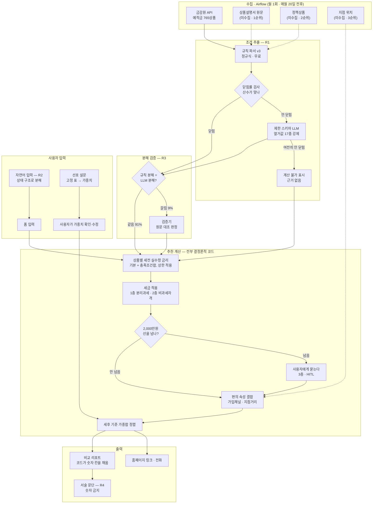

# 시스템 설계 — 부품·계약·측정

> 작성 2026-08-26 · 문제 정의는 [`problem.md`](./problem.md)
>
> **이 문서의 용도**: 다음 세션의 Agent가 설계를 이어받을 때 읽는 문서다.
> 사람이 작업 흐름을 따라가는 용도로는 [`problem.md`](./problem.md)와
> 시각 문서를 먼저 본다.
>
> **읽는 법**: 부품마다 `계약`(입출력) · `상태`(구현됐나) · `없으면`(빠지면 어떻게 되나) ·
> `측정`(무엇으로 값어치를 재나)이 붙어 있다. 넷 중 `없으면`과 `측정`이 핵심이다 —
> 이게 비어 있는 부품은 만들 근거가 아직 없다는 뜻이다.

## 1. 전체 흐름



**점선은 아직 데이터가 없는 경로다.**

## 2. 부품별 계약

### R1 — 조건 추출 (공시 문구 → 구조)

```
계약  입력: spcl_cnd 텍스트 + 가입기간(개월)
      출력: { cap: float|null, items: [{condition_type(17종), rate, polarity,
                                       applies_to_term, exclusive_group, evidence}] }
      금리(기본·최고)는 절대 입력에 넣지 않는다 — 채점 신호를 보면 값을 맞춰버린다
```

- **상태**: 구현 완료. `src/analysis/finlife_rules.py`(규칙 v3) ·
  `src/analysis/extract_llm.py`(제한 스키마 LLM)
- **없으면**: 실수령 금리를 계산할 수 없다. 시스템 전체가 성립하지 않는다
- **측정**: 닫힘률. 처음 보는 기관에서 규칙 62.6% · LLM 71.4% · **폴백 80.2%**
  (`../decisions/0007-rules-refined-then-closed.md`)

**폴백 구조가 핵심이다.** 규칙과 LLM이 서로 다른 것을 놓친다(규칙만 맞힌 16행,
LLM만 맞힌 32행). 그래서 순차로 태우면 둘 다 이기고 LLM 호출은 39%로 줄어든다.

> **주의**: 80.2%는 사후에 계산한 조합이다. 사전등록하고 잰 값이 아니다.
> 다음 실험의 1순위로 올려야 한다.

### R2 — 사용자 자연어 → 상태 구조

```
계약  입력: "급여이체 하고 카드도 쓰는데 1년에 월 50만원씩 넣을 적금"
      출력: { 급여_연금이체: true, 카드실적: true, term: 12, monthly: 500000 }
      출력 필드는 R1의 조건 유형 17종과 같은 축을 쓴다
```

- **상태**: 미구현
- **없으면**: 폼으로 받으면 된다. 시스템은 돈다. 편의성만 떨어진다
- **측정**: 필드별 추출 정확도. **틀리는 필드만 폼으로 확정 요청**하는 하이브리드가 목표

**개인정보 이유로 로컬 SLM을 1순위로 둔다.** 급여·소득·직장 위치가 입력이다.
API는 상한 기준선(ceiling)으로만 쓴다.

#### 계약을 좁혔다 — 조건 답을 채우는 데는 쓰지 않는다 (`decisions/0024`)

`0024`가 정한 원칙은 **"모른다고 임의로 체크하고 넘어가면 안 된다"**다. R2가
`"카드도 쓰는데"` → `카드실적: true`로 옮기는 것은 **사용자가 확인한 것이 아니라
시스템이 추정한 것**이다. 월 30만원 임계를 채우는지는 문장에 없다.

```
R2 가 하는 것       0단계 폼 채우기 — 가입 기간 · 월 납입액 · 예치금
                  이건 조건이 아니라 상품 목록을 만드는 검색 축이다. 추정해도 안전하다
                  질문 순서 미세조정 — 이미 말한 조건을 먼저 확인한다
R2 가 안 하는 것    조건 답을 확정하기
                  반드시 사용자가 "예 / 아니오 / 모르겠다" 로 확인해야 한다
```

**그래서 R2가 있으면 질문이 없어지는 게 아니라 덜 어색해진다** —
`"카드 쓰신다고 하셨는데, 월 30만원 이상 맞으신가요?"`가 된다.

### R3 — 분해 검증 (닫힘률이 못 잡는 것)

```
계약  입력: (공시 원문, "첫거래 조건이 0.35%p를 준다")
      출력: SUPPORTED / UNSUPPORTED / INSUFFICIENT
```

- **상태**: 미구현. 선행 저장소 `finance_verifier/src/verifier/client.py`가 같은 계약
- **없으면**: 합계는 맞는데 조건별 배분이 틀린 경우를 못 잡는다.
  사용자별 계산이 조용히 틀린다
- **측정**: 규칙 분해와 LLM 분해가 갈리는 비율 — **실측 9%**

**왜 닫힘률로 대체할 수 없나** — 닫힘률은 합계만 본다. 실제 관측 예시:

```
다시만난예금(모바일전용) 12개월 · 실제 폭 0.35
  규칙   항목 [0.25, 0.35] + 상한 0.35  → 합계 0.35  ✓ 닫힘
  LLM    항목 [0.35] (첫거래_신규고객)   → 합계 0.35  ✓ 닫힘

둘 다 "닫혔"지만 구조가 다르다. 첫거래만 충족하는 사용자에게
LLM 분해는 0.35를 주고, 규칙 분해는 답을 낼 수 없다.
```

### R4 — 리포트 서술 문단

```
계약  입력: 코드가 이미 채운 리포트 (숫자 칸 전부 확정)
      출력: 서술 칸만. 숫자 사용 금지
```

- **상태**: 미구현
- **없으면**: 템플릿으로 쓴다. 정확도에 영향 없다
- **측정**: **없다. 편의 기능으로 분류한다** — 잴 수 없는 걸 성과로 주장하지 않는다

**안전은 구조로 보장한다.** LLM 출력 스키마에 숫자 칸을 아예 넣지 않으면
과장할 수가 없다. 서술 칸 숫자 금지는 `assert not re.search(r"\d", prose)` 한 줄.

### 계산기 — 실수령 금리

```
계약  입력: (사용자 상태, 상품의 추출된 구조)
      출력: 실수령 예상금리 + 충족/미충족 조건 목록

      순서: 1. applies_to_term 이 false 인 항목 제거
            2. exclusive_group 은 합이 아니라 그룹 최댓값
            3. 사용자 상태로 충족 여부 판정
            4. 충족분 합계에 cap 적용
            5. 기본금리 + 위 값            = 세전 실수령 금리
            6. min(위 값, 공시 최고금리)     ← 상한. 원값은 raw_hi 로 남긴다
            7. 세율 적용                    = 세후 실수령 금리  ← 정렬은 이 값으로
            8. 층 라벨 부여                 확정 / 범위 / 설명부족 / 추출불확실 / 계산불가
```

- **상태**: **구현 완료** — `src/analysis/calculate.py`
- **없으면**: 시스템이 없다
- **측정**: 결정론적이라 단위 테스트로 충분. 정확도는 R1·R3에 달렸다

**모르는 것을 추측하지 않는다.** 사용자가 답하지 않은 조건이 있으면 하나의 숫자가 아니라
**범위**를 낸다(최소 = 확실히 충족되는 것만, 최대 = 모르는 것을 다 충족으로 가정).

#### 상호작용 모델 — 최고부터 보여주고 물어가며 깎는다 (`decisions/0017`)

**행원이 물어가며 좁히는 것과 같은 흐름이다.**

```
1단계  아무것도 안 물은 상태          "조건을 다 채웠을 때" 순으로 목록
       1. 카카오뱅크 우리아이적금  2.54 ~ 5.92%   남은 1개
       2. 토스뱅크 아이 적금     2.12 ~ 4.23%   남은 1개

2단계  걸린 상품이 가장 많은 것부터 묻는다     "대중교통 이용하십니까"
       공시 문구를 그대로 붙인다              [예] [아니오] [모르겠다]

3단계  답할수록 금리가 깎이고 순위가 바뀐다
       1. 카카오뱅크 우리아이적금  5.92%  확정      ← 폭이 닫혔다
       2. MZ 플랜적금          2.92 ~ 4.19%  남은 3개
```

- **정렬 기본값**: `net_hi` (최대). `--sort lo` 로 예전 동작
- **없으면**: 최소 순으로 시작하면 사실상 **기본금리 순**이라 조건이 좋은 상품이 묻힌다.
  두 정렬의 첫 화면은 상위 3위가 **0/3 겹치고**, 전부 답하면 **3/3 일치**한다
- **측정**: 답 하나마다 상위 3위·10위 교체 수. 실측 — 조건을 잘 채우는 사용자는 교체 0,
  거의 못 채우는 사용자만 두 번 크게 바뀐다(1위 5.92 → 4.19 → 4.06)

#### 되묻기 흐름 — 전부 묻고, 남은 수는 줄어들기만 한다 (`decisions/0024`)

**되묻기가 이 시스템의 존재 이유다.** 아무것도 안 물으면 조건을 다 채우는 사용자와
하나도 못 채우는 사용자에게 **똑같이 5.92%**를 보여준다. 후자의 실제 최대는 4.06%다 —
**과대 진술 1.86%p.** 되묻지 않으면 임의 추정과 다를 것이 없다.

```
0단계  검색 축을 받는다     **기관 · 상품군(예금/적금)** · 가입 기간 · 월 납입액 · 권역
                        조건이 아니라 상품 목록을 만드는 축이다. 폼으로 받는다
                        R2 가 있으면 여기를 자연어로 채운다 (조건 답은 채우지 않는다)
                        **질문은 이 후보 집합에서만 만든다** (`0028`) — 카탈로그
                        전체에서 만들면 관심 없는 기관 때문에 답하게 된다 (39개 → 7개)
                        지표는 반대로 **카탈로그 전체 고정**이다 (`prereg-11` §1)

1단계  첫 화면            최대 금리 순 (`0017`) · 전부 범위로 표시
                        최댓값 단독 표시 금지 · 상품마다 "남은 조건 N개"

2단계  질문 루프          `rank_questions()` 순서 — 커버리지 내림차순 → 사전순 (`0018`)
                        선택지  [예] [아니오] [모르겠다]  — 셋뿐이다 (`0027`)
                        임계도 숫자로 안 받는다. **공시 문구가 질문 문장이 된다** (`0027`)
                        답할 때마다 목록·범위·순위가 갱신된다

3단계  끝               더 물을 게 없으면 종료
                        확정 / 범위 + 사유 / 메인 밖(공시미반영·설명부족·추출불확실)
```

**질문 수를 제한하지 않는다.** 행원은 전부 확인한다. `ASK_BUDGET = 12`는 평가 지표로만
쓴다(`0018`은 원래 질문 부풀리기 방지 목적이었다). 전부 답하면 **은행권 39개 ·
저축은행 45개**다(`0027` 이후 — 임계를 문구별로 묻는다). 행원 면담 한 번 분량이다.

##### 상태바에 숫자 둘을 나란히 놓는다

```
진행   [###########.............]  답한 질문 6/22 · 남은 질문 16개
성과   금리가 정해진 상품 17/67개
```

**분모는 "모두 예"를 가정한 최대치다.** 그래야 남은 수가 **구조적으로** 줄어들기만 한다.
`rank_questions()`는 지금 물을 수 있는 질문만 내므로, 그것만 세면 "예" 답이 수치 후속
질문을 낳아 **남은 수가 늘어난다**(은행권 6곳 · 저축은행 12곳에서 관측). 상태바가 뒤로
가면 사용자는 "끝이 안 나는구나"로 읽는다.

이 최대 집합은 **아무것도 안 물은 상태에서 추출 데이터만으로 미리 계산된다**
(`question_plan()`). "아니오"·"모르겠다"는 그 유형의 수치 후속까지 같이 지우므로
2~3개씩 줄어든다 — 조건을 못 채우는 사용자일수록 빨리 끝난다.

**둘째 숫자가 필요한 이유** — 남은 질문 수만 보여주면 "모르겠다"가 "아니오"와 똑같이
진전으로 보인다. 둘 다 질문을 지우는데 "모르겠다"는 금리를 하나도 좁히지 못한다.

```
아니오 4개    진행 6/22    확정 17/67
모르겠다 4개   진행 6/22    확정  4/67     <- 진행은 같고 성과는 0
```

확정 상품 수가 그 차이를 정확히 가른다. 나란히 놓으면 **사용자가 대가를 스스로 보고,
우리는 답을 강요하지 않는다.**

##### "모르겠다"는 범위로 낸다 — hi 를 내리지 않는다

방어선은 **`lo`**에 있다. `lo`는 충족이 확인된 것만 더하므로 **"모르겠다"도 "아니오"도
한 푼도 들어가지 않는다**(`NH1934월복리적금`은 두 경우 모두 lo 2.16%로 동일).

`hi`까지 내리면 방어를 넘어 **단정**이 된다 — 아무것도 모른다고 답한 사용자에게
확정이 4개에서 **65개**로 뛴다. 과대 진술을 막은 자리에 "확정"이라는 거짓 라벨이
들어서고, 확인만 하면 받을 수 있는 좋은 상품이 순위에서 밀린다(`카카오뱅크
우리아이적금` 1위 → 3위 밖). `0017`이 막은 실패와 같은 모양이다.

##### 2단계 질문 루프 — `src/analysis/ask_loop.py` (2026-08-28)

**`0024`가 흐름을 정의했지만 질문을 하나씩 던지고 답을 받는 루프가 없었다.** 답을
`--state`에 미리 다 적어 넣는 방식이라 *"사용자가 22개를 실제로 답하는가"*를 확인할
길이 없었다. 그 루프가 이 파일이다. LLM을 부르지 않으므로 **돈은 안 든다.**

```
python src/analysis/ask_loop.py 20260826 --group bank --term 12     사람이 답한다
python src/analysis/ask_loop.py 20260826 --auto 예                   사람 없이 회귀 확인
python src/analysis/ask_loop.py 20260826 --answers 예,아니오,모름      대본으로 답한다
```

**세 페르소나가 `0024`의 실측표를 그대로 재현한다** — 루프가 시뮬레이션과 같은 답을
낸다는 확인이다.

| `--auto` | 질문 수 | 확정 | 1위 |
|---|---|---|---|
| 예 | 22 | 64/67 | 5.92% |
| 아니오 | 15 | 65/67 | **4.06%** — 되묻기가 깎은 폭 1.86%p |
| 모름 | 15 | **4**/67 | 5.92% |

**세션 로그(`ask_session_*.json`)가 `0024`의 반증 조건을 관측한다.** 질문마다 답 ·
경과 시간 · 남은 질문 수 · 확정 상품 수 · 1위 금리를 남기고, 중단하면 **몇 번째
질문에서 왜 멈췄는지**를 적는다. 사람이 한 번 완주해 봐야 알 수 있는 것들이다.

```
"모르겠다" 비율  절반을 넘으면 질문이 답할 수 없는 형태다 → P1(공시 문구 원문)을 다시 본다
중단 지점       기록만 한다. **지표가 아니다** (`0026` — 완주율로 설계를 바꾸지 않는다)
```

**중단률·완주율을 지표로 쓰지 않는다** (`0026`). 안 물은 조건은 `모름`이 되어 `hi`에
그대로 남으므로, 질문을 줄이는 것은 최고 금리를 유지한 채 근거만 없애는 것이다.
그 자리를 **중단 지점의 화면 계약 전수 검사**가 대신한다(아래 §화면 계약).

**답은 예/아니오/모름 셋뿐이다** (`0027`). 임계도 숫자로 받지 않고 **공시 문구를 질문
문장으로** 쓴다 — 한 유형 아래 대상이 다른 문구(적립식예금 잔액 · 펀드 보유액 ·
정기예금 가입액)가 묶여 있어 "얼마입니까"에는 답이 존재하지 않았다. 실측 세션에서
사용자가 `예`를 세 번 거절당한 뒤 **사실이 아닌 `아니오`로 답한 것**이 근거다.

#### 화면이 지켜야 할 계약 — 금리 숫자만 보여주면 틀린 화면이다

**아직 UI가 없다**(저장소에 `.html`·`.js` 0개). 그래서 지금 적어 둔다 — 계산기가 내는
것은 숫자만이 아니고, **숫자와 같은 급으로 보여줘야 하는 것이 셋 더 있다**
(`decisions/0015` · `0016`).

```
recommend_*.json 한 상품이 담는 것

  gross_lo · gross_hi     세전 범위        ← 하나가 아니라 범위다. 한쪽만 쓰면 안 된다
  net_lo · net_hi         세후 범위        ← 정렬 기준은 `net_hi` 다 (`0017`).
                                          선호 가중치가 있으면 세후 가중합 (`0030`)
  tier                    층 라벨          확정 / 범위 / 공시미반영 / 설명부족 / 추출불확실 / 계산불가
  questions[]             되물을 질문      키 · 단위 · 임계 · **공시 문구 원문**
  caveats[] caveat_text[] 못 채운 사유     사용자에게 보여줄 문장 그대로
```

**화면 필수 항목 아홉.** (1~4 가 원래 넷이고 5~9 는 뒤에 붙었다)

1. **범위는 범위로 보여준다.** `3.26~5.12%` 를 `5.12%` 로 줄이면 그 순간 과대 진술이다.
   `net_lo == net_hi` 일 때만 하나의 숫자로 쓴다.
   **이건 취향이 아니라 규제가 요구하는 것이다** (2026-08-31 확인 · `0034`) —
   금융소비자 보호에 관한 감독규정 제17조제1항제3호가목이 예금성 상품 광고에
   *"이자율ㆍ수익률 각각의 **범위 및 산출기준**"* 을 포함하라고 적고 있고,
   금융소비자보호법 제22조제4항제3호가목은 *"이자율의 범위ㆍ산정방법 (…) 을 명확히
   표시하지 아니하여 금융소비자가 오인하게 하는 행위"* 를 금지한다.
   **`0017` 강제 2(남은 조건 수)는 성질이 다르다** — 조문에 개수를 쓰라는 문구는
   없고, *"소비자에 따라 달라질 수 있는 거래조건을 누구에게나 적용될 수 있는 것처럼
   오인하게 만드는 행위"*(감독규정 제19조제1항제1호)를 막는 **우리 구현**이다
2. **되물을 질문을 화면에 올린다.** 아무것도 안 물으면 은행권 확정이 79개 중 4개뿐이고,
   전부 되물으면 64개다. **되묻기가 이 시스템의 주된 동력이다.** 질문 옆에 공시 문구
   원문을 그대로 붙인다 — 우리가 요약하면 사용자가 판단할 근거를 빼앗는다
3. **답 선택지에 "모르겠다"를 둔다.** 안 물어본 것과 "물었고 모른다"는 다르다.
   후자는 되물을 목록에서 빼고 `모름` 사유를 붙인다
4. **사유 문장을 숨기지 않는다.** 특히 `이행필요` 는 은행권 46개 상품에 붙는다 —
   이게 안 보이면 사용자는 **자기가 못 받을 금리**를 보게 된다

```
좋은 화면                              나쁜 화면
NH1934월복리적금                        NH1934월복리적금
연 3.26 ~ 5.12%  (세후)                연 5.12%
  대중교통 이용하십니까?  [예][아니오][모름]
  가입 후 계속 실천해야 받는 금리가
  포함돼 있습니다
```

- **없으면**: 계산기가 정직하게 범위를 내도 **화면에서 과대 진술이 된다.** 지금까지
  `0011`·`0015`·`0016` 에서 막아온 실패가 마지막 한 칸에서 되살아난다
- **측정**: 화면 코드에 `assert` 를 박는다 — 범위가 있는 상품에 단일 숫자를 렌더하면
  실패, `caveat_text` 가 비어 있지 않은데 화면에 없으면 실패
5. **가입 채널을 상품 옆에 붙인다** (이슈 #22 · assert A9). 저축은행 **263건(39%)이
   영업점에서만** 가입되는데 그걸 모르면 갈 수 없는 상품을 후보로 본다. **점수에는 안
   넣는다** — `problem.md` §6 대로 축으로 보여주고 가중치는 사용자가 정한다
6. **스코프를 걸면 밖의 최고 금리를 같이 보여준다** (`0028` S4 · assert A7).
   기관별 격차 중앙값이 **2.41%p**(은행권 16곳 중 15곳이 1.0%p 초과)라, 안 보여주면
   좁힌 대가를 사용자가 모른다 — `0017` 이 막은 실패("좋은 상품이 묻힌다")와 같은 자리다
7. **선호 가중치를 화면에 보여주고 고칠 수 있게 한다** (`0030` · assert A10·A11).
   가중치는 **금리 %p 환산**이라 `영업점만 -0.50%p` 라고 그대로 적을 수 있고, 그래야
   `problem.md` §3 이 약속한 *"왜 이 순서인지가 같이 나온다"* 가 성립한다.
   **가중치는 정렬만 바꾼다**(A11) — 층·범위·사유가 선호에 따라 변하면 사용자의 취향이
   "이 상품의 금리가 얼마인가" 라는 사실을 바꾸는 것이고, 그 순간 `problem.md` §4 의
   *"틀릴 수 없는 것 / 틀릴 수 있는 것"* 구분이 무너진다.
   **선호로 상품을 목록에서 빼지 않는다** — 맨 아래로 내리고 이유를 그 줄에 적는다.
   빼면 A7 과 똑같은 은폐 방지 장치를 하나 더 만들어야 한다
8. **금리 숫자 옆에 `세전`·`세후` 를 반드시 쓴다** (2026-08-31 · `0034`).
   공정거래위원회 예규 「금융상품 등의 표시·광고에 관한 심사지침」 Ⅴ.1.마 가
   *"수익률(이자율) 표기시 '세전'인지 '세후'인지를 누락하여 표시·광고하는 것은
   부당한 표시·광고에 해당할 수 있다"* 고 적고 있다(금소법 제22조제5항이
   표시광고법을 함께 걸어 둔다). **CLI 는 이미 지키고 있다** — 헤더가
   `세후 확정~최대` · `세전` 이다. **다만 assert 가 없다**(A12 후보) — F4 로 옮길 때
   조용히 사라질 수 있는 종류라 여기 적어 둔다
9. **선호가 걸리면 성과 줄을 `최고` 가 아니라 `1위` 라고 쓴다** (`0030`).
   선호 정렬에서는 1위가 최고 금리가 아니다 — 실측으로 1위 2.88% 인 화면의 3위가
   3.26% 였다. 말 한 단어가 `0019` 의 부산은행과 같은 모양을 만든다

- **2026-08-28에 그 검사를 만들었다** — `src/analysis/check_screen_contract.py`.
  질문 0개부터 끝까지 **모든 중간 상태**에서 A1~A11을 본다(사용자가 12번째 질문에서
  그만두면 보는 화면이 `ask_loop.render_final_screen()` 이고, 검사가 같은 함수를 읽는다).
  **위반 두 건을 찾았다** — 폭이 남은 상품의 `확정` 라벨(16종)과 `미응답`·`수치필요`
  문장 누락. 사전등록·결과는 `prereg-09`

#### 공시 최고금리 상한 — 그리고 그게 무엇을 가리는지

```
저축은행 전체 기간 1,090행
  넘침    705   64.7%
  모자람   29    2.7%
  맞음    356   32.7%

상한을 걸면 공시 초과 표시 0건. 가장 심한 예 11.50% → 8.00%
```

**넘치는 이유는 대부분 우리 잘못이 아니다 (E10 결과).**

```
넘침 705행
  폭 0 인 행    682   96.7%   ← 공시가 우대분을 최고금리 칸에 안 넣었다. 우리 잘못이 아니다
  폭 > 0        23    3.3%    ← 진짜 과다 추출
```

**폭 0 행에서는 어떤 추출도 넘친다** — 0보다 큰 값은 다 초과다. `0006`이 이미 그
908행을 "채점할 수 없는 행"으로 판정했는데, 계산기를 만들 때 그 필터를 안 넣었다.

`raw_hi`(상한 전 값)는 남겨 측정에 쓴다.

**닫힘률이 방향을 감췄다** — 절댓값만 봐서 넘쳤는지 모자랐는지 구분하지 않았다.
`compare_extractors.py` 에 **부호별 보고를 넣었다**(2026-08-26). 넣자마자 새 사실이
하나 보였다.

```
                    A 규칙       B 스키마
넘침                735          705
  그중 폭 0 행       694          682
  진짜 과다 추출      41           23      ← B 가 규칙의 절반 수준이다
```

**진짜 과다 추출에서 B가 A보다 낫다.** 닫힘률 하나만 보면 안 보이던 차이다
(홀드아웃 닫힘률은 63.2% vs 71.4%로 유의하지 않았다). 지표를 방향별로 나누면
같은 데이터에서 다른 것이 보인다.

#### 진짜 과다 추출 23행의 원인 (E10)

| 원인 | 예 |
|---|---|
| `(고시금리 포함)` 표기 — 기본금리에 이미 포함된 값 | 처음만난적금 −3.50%p |
| **`threshold` 누락** — "장애인 0.2% (1천만원 이하, 12개월 약정시)" | 정기예금 −0.25%p |
| 복합 조건 — "인터넷뱅킹 등록 **후 당일 창구** 신규시" | 정기예금 −0.10%p |

**`threshold` 는 `prereg-03` §6.1에서 "닫힘률 산수에 쓰이지 않는다"고 제외한 필드다.**
사용자별 계산에서는 필요하다. 넣으려면 재추출($1)이 필요하고, 별도 결정이다.

#### 층 라벨 — 제외하지 않는다

| 층 | 무엇 | 화면 |
|---|---|---|
| 확정 · 범위 | 계산할 수 있다 | **메인** |
| **공시미반영** | 조건문에 우대가 있는데 공시 최고금리에 없다 | 아래 · "은행 확인 필요" |
| 설명부족 | 공시 최고금리 일부가 설명 안 된다 | 아래 · "근거 없음" |
| 추출불확실 | 우리가 많이 뽑았다 | 아래 · "해석 불확실" |
| 계산불가 | 항목을 못 뽑았다 | 아래 |

```
저축은행 12개월    메인 109  ·  공시미반영 176  ·  설명부족 6  ·  추출불확실 5  ·  계산불가 1
```

**`공시미반영`과 `추출불확실`을 가른 것이 E10의 핵심 결과다.** 처음에는 181건을 전부
`추출불확실`(우리 잘못)로 묶었는데, 세어 보니 176건은 공시 문제였다. 두 층은 사용자에게
다른 말을 해야 한다 — 하나는 "은행에 확인하세요", 하나는 "우리 해석이 불확실합니다".

제외하면 63%를 버리고, 닫힘률이 100%로 고정되어 개선을 측정할 수 없다.

### 세금 계산 — 세후 금리

```
계약  입력: (세전 실수령 금리, 예치금액, 기간, 사용자 자격, 기존 금융소득[3층만])
      출력: 세후 실수령 금리 + 적용 세율 + 3층 해당 여부
```

- **상태**: 미구현
- **없으면**: 세전 금리로 줄을 세운다. **순위가 틀린다** — 비과세 상품은 세전이 낮아도
  세후로 이긴다
- **측정**: 결정론적이라 단위 테스트. 다만 **세율표가 맞는지는 사람이 확인해야 한다**

**정렬 기준은 세후 금리다.** 세전으로 정렬하면 사용자가 실제로 받는 순서와 달라진다.

#### 3층 구조 — 확실성이 층마다 다르다

| 층 | 무엇 | 확정값인가 | 추가 입력 |
|---|---|---|---|
| **1** | 분리과세 세후금리 (원천징수) | **확정** | 없음 |
| **2** | 비과세·세금우대 적격 판정 | **확정** | 없음 — `고객군_자격`으로 이미 묻는다 |
| **3** | 금융소득종합과세 | **범위만** | 기존 금융소득 · 종합소득 |

**1·2층은 바로 보여준다. 3층은 선을 넘을 때만 사용자에게 묻는다.**

```
세전 이자를 계산한다
  → 기존 금융소득 + 이 상품 이자가 2,000만원 선을 넘는가        ← 검사 게이트
     안 넘음  →  분리과세로 확정. 끝
     넘음    →  사용자에게 종합소득을 묻는다 (HITL)
     경계 근처 →  "경계에 가깝습니다" 로 표시. 단정하지 않는다
```

**이건 이 시스템의 세 번째 escalation 게이트이고, 앞의 둘과 같은 모양이다** (§3).
예측이 아니라 **계산해보고 걸린 것만** 다음 단계로 보낸다. 그래서 대부분의 사용자에게는
소득 질문이 아예 뜨지 않는다.

#### 3층에서 약속하지 않는 것

물어봐도 **최종 세액은 낼 수 없다.** 인적공제·세액공제·다른 소득 종류가 필요하다.

```
할 수 있는 것   세율 구간을 특정한다 · 범위를 좁힌다
                "이 상품에 얼마까지 넣으면 선을 안 넘는가"  ← 역산은 확정된다
할 수 없는 것   최종 세액
```

**질문 화면에 무엇을 얻는지 정확히 적는다.** "정확한 세금을 계산해드립니다"는 거짓이다.

#### 지켜야 할 것

- **세율표를 코드에 박지 않는다.** 별도 파일 + **적용 시점 명시**(스냅샷 ID를 고정한 것과
  같은 방식). 세법은 매년 바뀌고 특례는 일몰이 있다
- **세율 숫자는 구현 시점에 국세청·법제처에서 확인한다.** 설계 문서의 숫자를 그대로
  쓰지 않는다
- **소득 정보는 저장하지 않는다.** 계산에만 쓰고 버린다. 급여이체 여부와 민감도가 다르다
- **참고용임을 표시한다.** 세무 자문으로 오인되면 안 된다

#### 데이터 현황

공시에 세금 정보가 거의 없다 — 그래서 우리가 계산해야 한다.

```
765개 상품 중
  비과세종합저축 언급    3건 (조건문 1 · 기타사항 2)
  비과세 언급           17건 (기타사항)
  세금우대 · ISA · 원천징수   0건

금감원 웹사이트는 세전·세후를 나란히 보여주지만 API는 세전만 준다
```

### 검색 (RAG) — SPLADE + 벡터 하이브리드

```
계약  입력: 자연어 질의
      출력: 관련 문서 조각 + 근거 위치
```

- **상태**: 미구현. **선행 조건 미충족**
- **없으면**: 조건문 177개(A4 9장)는 프롬프트에 통째로 들어간다. 검색이 필요 없다.
  다만 "급여이체를 뭘로 인정하나" 같은 상품설명서 질문에 답할 수 없다
- **측정**: 조건 유형 17종이 그대로 정답 라벨이 된다

> **선행 조건**: 상품설명서 코퍼스. **없으면 만들지 않는다.**
> 177개 문서에 검색을 붙이는 건 `KAG_LlamaIndex`가 한 실수(구조부터 만들고 쓸 곳은
> 나중에)와 같은 모양이다.

**묶는 축은 기관이다** (`../decisions/0014-institution-is-the-grouping-axis.md`).
조건 유형 집합의 유사도로 재보면 기관 2.17배 · 상품군 1.25배 · 권역 1.23배다.
그런데 기관으로 묶고 나면 기관을 넘는 고유사도 쌍이 0.3%뿐이고, 조건 4개 이상
상품에서는 0%다 — **유사도·그래프 투영이 찾아낼 구조가 없다.**

**SPLADE를 고른 근거는 데이터에 있다.** 같은 조건을 공시가 여러 표현으로 쓴다.

```
비대면가입  32종   "비대면" · "인터넷/모바일뱅킹을" · "스마트폰뱅킹의"
카드실적    23종   "신용(체크)카드" · "NH채움카드" · "[zgm고향으로카드]"
마케팅동의  17종   "마케팅동의" · "수집/이용" · "수신동의"
급여이체    11종   "급여이체" · "소득이체" · "급여실적"
```

사용자는 "월급통장"이라 쓰고 공시는 "소득이체"라 쓴다. BM25는 못 잇는다.

### 리랭커 (PEFT)

- **상태**: 미구현. 선행 저장소 [`reranker_FT`](https://github.com/hyos0415/reranker_FT)에
  파이프라인 있음. **단 그 저장소는 성능 수치를 철회했다**(`EVAL_AUDIT.md` — 결함 4건)
- **없으면**: 하이브리드 검색 상위 K를 그대로 쓴다
- **측정**: 베이스 리랭커 대비 개선폭. **철회된 수치를 대체하는 첫 제대로 된 측정이 된다**

> **선행 조건**: RAG와 같다. 조건문 177개로 PEFT 하면 과적합만 배운다.
> 다만 **하드 네거티브 설계는 지금 가능하다** — 위 표면형 변형이 그대로 재료다
> ("이벤트금리(비대면금리)"는 비대면 단어가 있지만 유형이 다르다).

## 3. 게이트와 라우터 — 이 설계의 핵심 원칙

**예측하는 라우터를 앞에 세우지 않는다. 검사하는 게이트를 뒤에 둔다.**

```
예측 라우터    "이건 어려워 보이니 LLM으로"     틀렸는지 알 수 없다. 오류가 전체 상한이 된다
검사 게이트    "규칙으로 돌려봤더니 산수가 안 맞음"  틀렸는지 바로 안다. 오류는 비용 낭비로 끝난다
```

| | 자리 | 형태 | 위험 |
|---|---|---|---|
| 1 | R1 폴백 (규칙 → LLM) | **검사 게이트** (닫힘률) | 낮음 — 측정 완료 |
| 2 | R3 게이트 (분해 일치?) | **검사 게이트** (불일치 탐지) | 낮음 |
| 3 | **질의 유형 라우팅** | **예측 라우터** | **높음 — 실험 대상** |
| 4 | 모델 라우팅 (로컬 SLM ↔ API) | 캐스케이드 | 중간 |
| 5 | 세금 3층 (2,000만원 선) | **검사 게이트** (금액 비교) | 낮음 — 넘을 때만 사용자에게 묻는다 |

**3번만 예측이 불가피하다.** 필터 질의 · 문서검색 질의 · 계산 질의 · 비교 질의는
먼저 다 돌려보고 고르기 어렵다.

### 라우터를 넣을 때 지킬 것

```
1. 라우터 오류가 복구 가능하게 만든다 (일방통행 문이 아니라 회전문)
     필터로 보냈는데 결과 0건  → 검색으로 폴백
     검색으로 보냈는데 근거 점수 낮음 → 필터로 폴백
2. 오라클 상한을 같이 잰다
     오라클 ≈ 라우터없음   → 라우팅 자체가 불필요. 라우터를 고칠 게 아니라 뺀다
     오라클 >> 실제 라우터  → 라우팅은 값어치 있는데 라우터가 약하다
```

**라우터 정확도는 그 자체로 의미가 없다.** "오라클 대비 몇 %를 회수했나"가 성적표다.

## 4. 실험 목록 — 선행 조건과 함께

> **2026-08-31에 [`roadmap.md`](./roadmap.md) 로 옮겼다.** 실험 E1~E12 를 포함한
> **전체 과업 지도**가 그 문서에 있다 — 부품별 상태(✅ 완료 · ▶ 지금 가능 ·
> ⏸ 선행 조건 대기 · 🙋 사람 결정)와 선행 조건, 에픽 이슈(#16~#20) 링크가 함께 있다.
> **상태는 그 문서에서만 고친다.** 여기 표를 두면 두 군데가 서로 다른 말을 한다.

**E8이 은근히 중요하다.** 조건문 177개는 사람이 하루면 손으로 구조화한다.
AI가 정당화되는 근거는 "한 번 만들기"가 아니라 **"매달 다시 만들기"**다.
E8이 "월 5건"이면 AI 없이 가고, "월 60건"이면 필요하다.

**단 질문을 다시 정의했다** (`../decisions/0010-disclosure-updates-monthly.md`).
같은 달 안에서는 공시가 바뀌지 않는다 — 8/24 → 8/26 비교에서 97상품 **변화 0건**.
그러므로 E8은 **월 경계**에서만 잴 수 있고, 9월 공시가 올라와야 한다.

## 4.1 수집 주기 — 월 1회 (실측)

```
공시월(dcls_month)  202608
공시 시작일          은행 17곳: 8/20 에 95건 · 8/21 에 2건        거의 같은 날
                    저축은행 79곳: 8/20 318 · 8/24 35 · 8/22 20 · 8/21 18   흩어져 들어온다
같은 달 안 변화      8/24 → 8/26, 97상품 중 0건
```

**따라오는 것 세 가지.**

1. **Airflow는 일간이 아니라 월간이다.** 매월 20일 전후에 돌리고, 나머지 날은 갱신 감지만
2. **"이번 달 것이 다 들어왔나"를 판정해야 한다.** 저축은행은 며칠에 걸쳐 들어오므로
   `dcls_strt_day`가 이번 달인 기관 수를 세어 수집 완료를 판단한다
3. **AI 재추출 비용이 거의 문제가 안 된다.** 전체를 월 1회만 다시 뽑으면 되고,
   폴백 구조면 39%만 호출한다 — 228쌍 $1 기준 **연 $12 수준**

## 4.2 추후 과제 — 대출 상품군

금감원 API에는 예적금 말고도 주택담보대출 105 · 전세자금대출 57 · 개인신용대출 114건이
있다. **그런데 지금 기계가 그대로 옮겨가지 않는다** (2026-08-26 실측).

```
                우대조건 문구      금리 구조                    닫힘률
예적금           spcl_cnd ✓       기본 → 조건 → 최고            성립
주택담보대출      없음             최저 · 평균 · 최고             성립 안 함
전세자금대출      없음             최저 · 평균 · 최고             성립 안 함
개인신용대출      없음             신용등급 1·4·5·6·10~13별 금리   성립 안 함
연금저축         응답이 비거나 실제로는 대출 상품이 온다
```

**조건이 금리를 만드는 구조가 아니다.** 대출의 실제 금리는 심사가 정하므로
"내 조건이면 이 금리"가 계산되지 않는다. 추천의 정답 정의부터 달라진다.

**하려면 별도 상품군 + 별도 규칙으로 분리해야 한다.** 추후 과제로 둔다.

## 4.3 대기 중인 작업 — 잊지 않기 위해 적어둔다

- **벡터화 · 벡터 DB 설계** — 상품설명서 수집이 끝나면 착수한다. RAG(§2 검색)의
  선행 작업이다. 청킹 단위·임베딩 모델·인덱스 구조·SPLADE와 벡터를 어떻게 합칠지를
  정해야 한다. **수집 전에는 시작하지 않는다** — 문서가 어떻게 생겼는지 봐야
  청킹 단위가 정해진다
- **대출 상품군** (§4.2)
- **이슈 #2 · #3** — 새 타깃에 맞춰 판정 기준을 사전등록 문서로 옮기는 일

## 5. 지금 상태

```
구현됨
  수집        src/ingest/fetch_finlife.py  (--group bank|savingsbank)
  규칙 파서    src/analysis/finlife_rules.py  v2(고정) · v3(규칙 H·I·J)
  LLM 추출    src/analysis/extract_llm.py    열거값 17종 + structured outputs
  채점        src/analysis/score_extraction.py  (--rules v2|v3 --group)
  비교        src/analysis/compare_extractors.py  McNemar·Wilcoxon·클러스터 부트스트랩
  계산기      src/analysis/calculate.py      상태 매칭 · 층 라벨 · 정렬 · 되묻기 목록
  질문 예산    src/analysis/ask_budget.py     질문을 하나씩 늘려가며 재는 곡선
  질문 루프    src/analysis/ask_loop.py       되묻기 2단계 — 하나씩 묻고 답을 받는다
  화면 계약    src/analysis/check_screen_contract.py  중간 상태 전수 assert (A1~A11)
  스코프 조사   src/analysis/scope_survey.py    스코프별 질문 수 · 좁히는 대가
  선호 가중치   src/analysis/prefs.py          설문 5문항 -> 고정 표 -> 조정 %p (`0030`)
  선호 조사    src/analysis/prefs_survey.py   순위 교체 수 · 지표 무변동 가드

미구현
  R2 · R3 · R4 · 리포트 · UI(저장소에 .html·.js 0개)
  편의 속성은 **표시**(A9)와 **정렬**(`0030`)까지 됐고 지점 거리는 데이터가 없다
  RAG · 리랭커 · 라우터 · Airflow
```

**v2는 절대 수정하지 않는다.** 파일럿 30문항과 gold가 v2로 만들어졌다.
상품 765 × 기간 6 × 함수 6 전수 비교로 v3 추가가 v2를 안 건드렸음을 확인했다.

## 6. 하지 말 것

- **선행 조건이 안 채워진 부품을 먼저 만들지 않는다** — RAG·리랭커는 코퍼스 대기
- **예측 라우터를 앞에 세우지 않는다** — 검사 게이트로 대체 가능한지 먼저 본다
- **잴 수 없는 것을 성과로 주장하지 않는다** — R4는 편의 기능이라고 적는다
- **LLM이 숫자를 만지게 하지 않는다** — 스키마에서 분리한다
- **홀드아웃을 보고 규칙을 고치지 않는다** — 고치면 홀드아웃 자격을 잃는다
- **측정 뒤에 기준을 정하지 않는다** — 사전등록이 이 저장소의 규율이다
